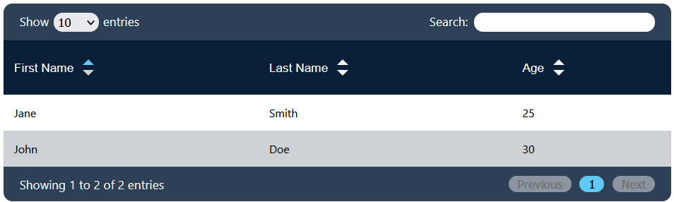

# react-data-tables-plugin

Note: This project was developed as part of the JS/React Application Developer training program at OpenClassrooms. It is a partial adaptation of the jQuery DataTables plugin (https://datatables.net/).

`react-data-tables-plugin` is a React component for displaying data in tabular format. It provides various features to manage and customize the presentation of your data. This plugin is designed to simplify the process of integrating data tables into your React applications.

## Features

- Display data in a tabular format.
- Sort data by columns in ascending or descending order.
- Control the number of entries per page.
- Implement search and filtering capabilities.
- Display pagination for easy navigation through large data sets.
- Color scheme customization to match your application's style.

## Installation

You can install the `react-data-tables-plugin` via npm:

```bash
npm install react-data-tables-plugin
```

## Usage

To use `react-data-tables-plugin`, you need to import it into your React application and pass the necessary data and configuration as props. Here's a very basic example of how to use the plugin:

```jsx
import React from "react";
import DataTable from "react-data-tables-plugin";

const columns = [
  {
    title: "First Name",
    data: "firstName",
  },
  {
    title: "Last Name",
    data: "lastName",
  },
  {
    title: "Age",
    data: "age",
  },
];

const data = [
  {
    firstName: "John",
    lastName: "Doe",
    age: "30",
  },
  {
    firstName: "Jane",
    lastName: "Smith",
    age: "25",
  },
];

function App() {
  return (
    <div>
      <DataTable columns={columns} data={data} />
    </div>
  );
}

export default App;
```



## Configuration

### Properties

| Prop Name | Type | Required | Description |
| --- | --- | --- | --- |
| columns | Array of Objects (IColumn[]) with 'title' (string) and 'data' (string) properties | true | An array of objects that define the configuration of table columns. Each object should have a 'title' property (string) for the column title and a 'data' property (string) specifying the data key to display in that column. |
| data | Array of Objects (IRow[]) with string keys and string values | true | An array of objects where each object represents a row of data with string keys and string values. |
| className | string | false | Custom class name for styling (optional). |
| mainColor | string | false | The main color for custom styling (optional). |
| accentColor | string | false | The accent color for custom styling (optional). |
